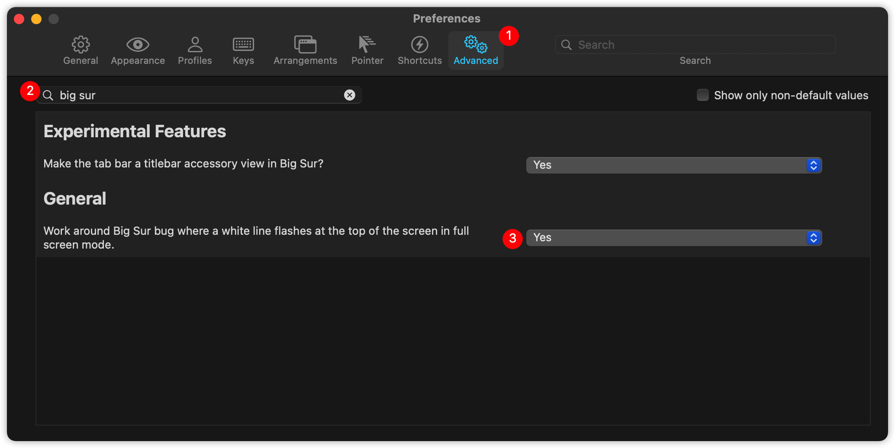

## 起因

在更新**BigSur**之后的某一天，突然发现**iTerm2**在全屏模式下，顶部不时会出现一条白色的线闪动。后来在一个论坛里面看到有人说貌似是系统的问题。但是很奇怪，室友的电脑上就没有这样的情况。中间也试过重装系统（PS：强迫症重度患者），但还是会出现。

通过排查，发现只有**iTerm2**配色选择<u>*深色*</u>主题，并且**系统**主题为<u>*浅色*</u>主题时，才会出现上述的问题。

> 系统版本：macOS Big Sur 11.2.3

> iTerm2版本：Build 3.4.4

## 解决

打开iTerm2<u>*偏好*</u>设置，选择<u>*高级*</u>。在<u>*文本框*</u>中输入<u>**big sur**</u>，把通用这一行改为<u>**是**</u>即可。如图1.

    
     
    
图1. 操作顺序

## 参考

1. https://blog.csdn.net/lxyoucan/article/details/115085694
2. https://gitlab.com/gnachman/iterm2/-/issues/9199