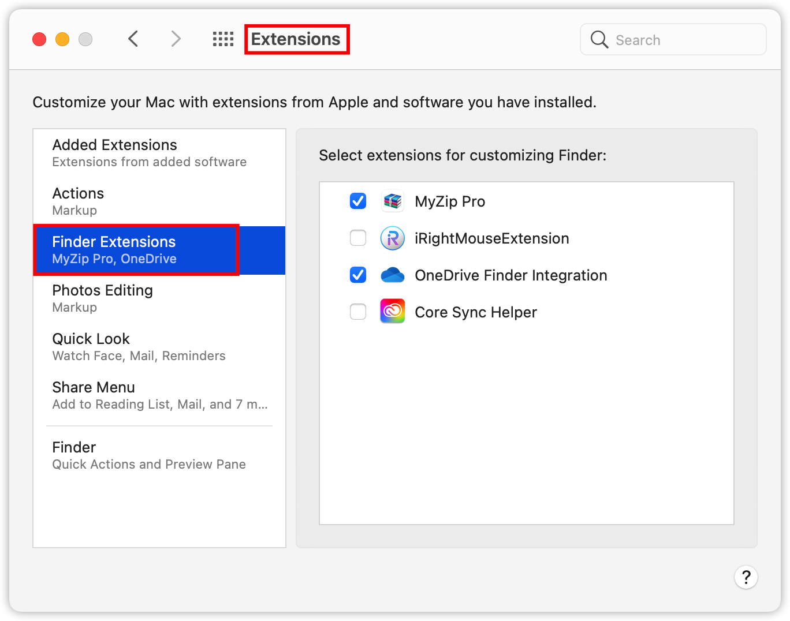

<u>**问题描述**</u>：访达侧边栏移动硬盘的图标显示如图1，感觉是不正常的显示。图2为正常显示的图标。

<u>**环境**</u>：

> macOS: Big Sur 11.2.3
> 移动硬盘：希捷
> iRightMouse: 2.1.1

    
     
    
图1. 显示异常的图标

    
     
    
图2. 正常显示的图标

<u>**解决方案**</u>：在<u>**系统偏好设置**</u>里面的<u>**扩展**</u>模块，把<u>**新近安装**</u>的访达扩展<u>**取消勾选**</u>即可（图3）。本机问题为超级右键的扩展导致的。取消勾选即可恢复正常的磁盘图标。但是取消之后，相关软件在访达里面的扩张功能也就没办法使用了。请自行斟酌。

    
     
    
图3. 操作顺序

### 参考

1. https://discussionschinese.apple.com/thread/252297105

