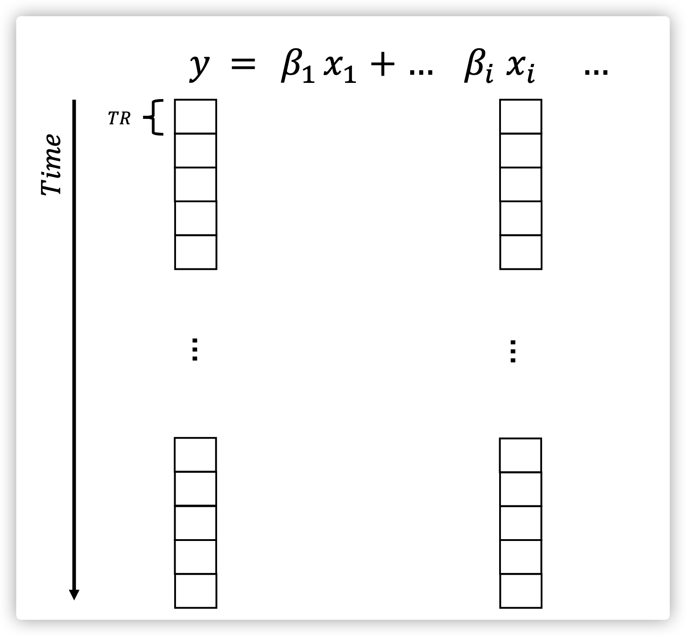

在对**fMRI**数据，尤其是**task-fMRI**数据进行分析的时候，利用广义线性模型进行建模是很重要的一步。这里简单记录一下自己关于这部分的理解。

我们的大脑每时每刻都在活动，也就造成了<u>**血氧水平的变化（BOLD）**</u>。理论上在接收到刺激以后，大脑BOLD信号的变化符合<u>**血氧动力学函数（HRF）**</u>。但是考虑到各种因素，最终大脑的变化是非常复杂的。磁共振技术可以用来收集大脑的**BOLD**信号。在每个**TR**内，都会生成一个全脑或者一定范围内大脑活动的三维图像。对于其中的一个体素来说，假设它的信号为**$y$**。这里只考虑一种刺激条件的情况。如图1所示。

    
     
    
图2. 理论上，BOLD信号和体素y信号的关系。

当给予刺激之后，根据刺激的时间、时长和HRF，我们可以估计出某个体素理论上的BOLD信号。然后在这段时间内进行采样，就可以得到一系列的**$y$**和对应理论上的BOLD信号**$x$**（图2）。通过广义线性模型，我们就可以估计出相应的系数**$\beta$**。

    
     
    
图2. 通过采样之后BOLD信号和体素y信号的关系

