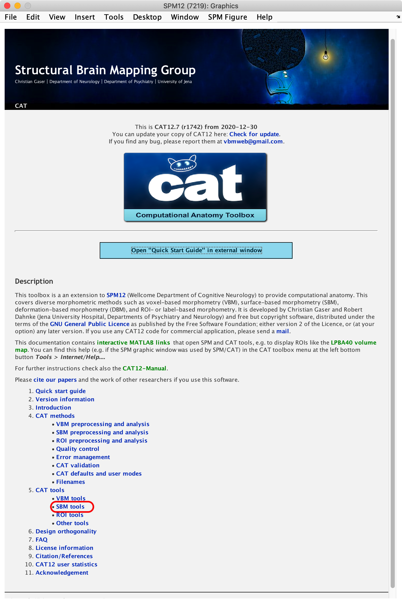
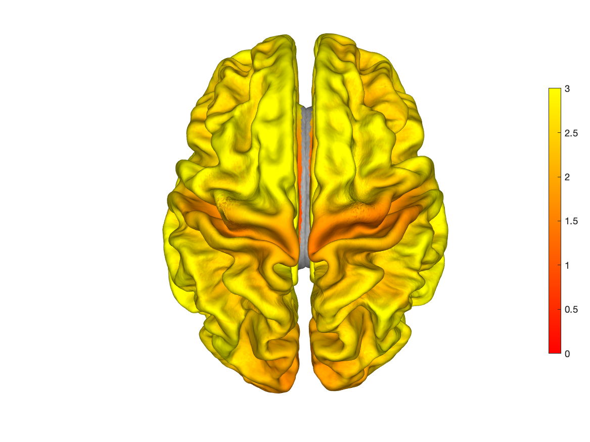

[CAT12](http://141.35.69.218/cat/index.html)作为一种常用的神经影像数据处理和分析工具包，它提供了很多实用的功能，包括但不限于完整的VBM和SBM分析模块以及相关的统计模块。这里简单记录一下笔者使用[CAT12](http://141.35.69.218/cat/index.html)在显示皮层厚度时遇到的问题和相应的解决方法。

### 问题描述

[CAT12](http://141.35.69.218/cat/index.html)的GUI窗口中有个**Display Surface**的按钮（图1），可以在窗口中通过选择并显示相应的.gii文件（可以显示的文件有**surf/[r|l]h.[sphere|central].name.gii**）。但是对于重采样后的皮层指标，例如皮层厚度thickness (文件名为**surf/s[fwhm].mesh.thickness.resampled.name.gii**)，却不能通过相同的方式去显示。

<center>
    
    <br>
    <div style="color:orange; border-bottom: 1px solid #d9d9d9;
    display: inline-block;
    color: #999;
    padding: 2px;">图1. CAT12图形化界面</div>
</center>

### 解决方法

首先查询CAT12手册，但是手册中并没有相关的描述。进而在CAT12帮助界面中查找。发现在**Surface tools**中有关于可视化皮层数据的相关函数的介绍和演示（图2）。

<center>
    
    <br>
    <div style="color:orange; border-bottom: 1px solid #d9d9d9;
    display: inline-block;
    color: #999;
    padding: 2px;">图2. CAT12帮助界面</div>
</center>

随后确定**cat_surf_display**函数可以进行皮层指标的可视化，同时GUI中的**Display Surface**按钮调用的也是这个函数。通过**help cat_surf_display**查看该函数的说明，确定函数的输入参数以及参数的格式。最终，用于可视化皮层厚度的代码如下：

皮层厚度文件为**surf/s15.mesh.thickness.resampled.anat.gii**，显示效果如图3。

```matlab
cat_surf_display(struct('data', 'surf/s15.mesh.thickness.resampled.anat.gii', 'usefsaverage', 1, 'multisurf', 1, 'dpi', 1500, 'caxis', [0, 3], 'colormap', 'autumn'))
```

<center>
    
    <br>
    <div style="color:orange; border-bottom: 1px solid #d9d9d9;
    display: inline-block;
    color: #999;
    padding: 2px;">图3. 皮层厚度显示效果</div>
</center>


另外，可以在弹出的绘图窗口上，右键单击来调整显示的参数和保存图片（图4）。

<center>
    
    <br>
    <div style="color:orange; border-bottom: 1px solid #d9d9d9;
    display: inline-block;
    color: #999;
    padding: 2px;">图4. 显示参数调节</div>
</center>

### 相关连接

[1] http://141.35.69.218/cat/index.html
