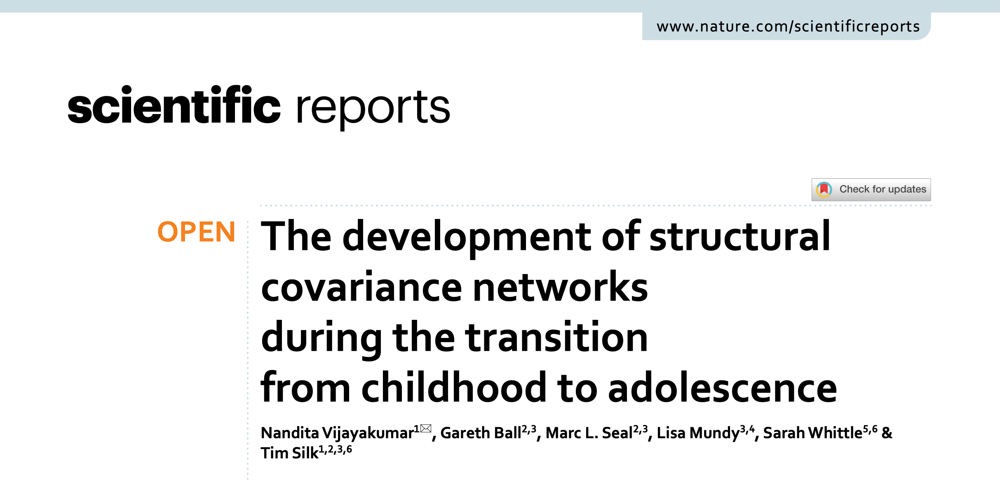
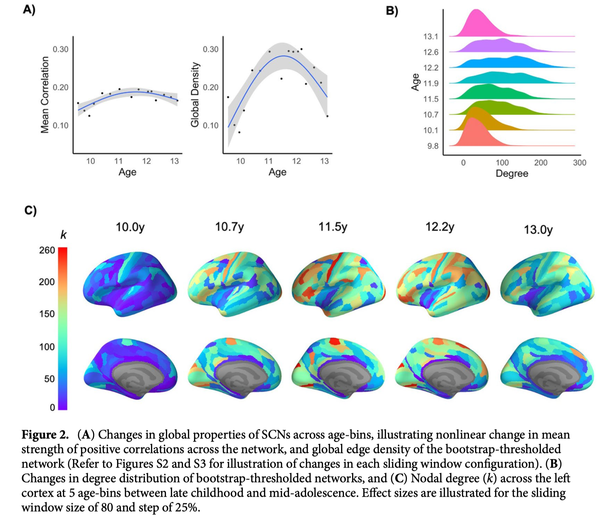
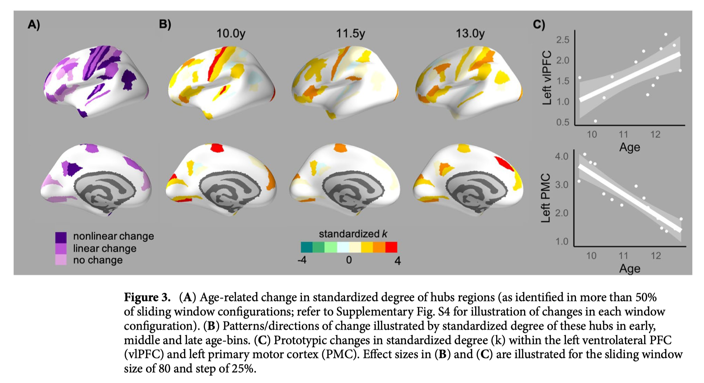

期刊：Scientific Reports, (2021)11:9415

<!-- -->

## 摘要

结构共变（SCN）是指在群体水平上不同大脑区域形态学指标之间的相关。它可以为发育期功能性网络模块的形成提供皮层结构的信息。本研究探究了从儿童期到青少年期大脑结构共变网络的变化模式，而这一时期会发生明显的大脑结构性的重组。本研究的被试在他们8.5岁到14.5岁之间进行了核磁扫描。研究者使用滑动时间窗方法选择一组被试作为“age-bin”，在每个“age-bin”上建模得到结构共变网络。之后，研究者使用广义加性模型（GAM）检查网络属性的随龄变化模式。结果显示了平均连接强度和网络密度的非线性变化轨迹。这表明在青少年早期阶段存在一段皮层结构属性趋同的时期，对应于前人研究中的脑区特异化现象。在儿童后期，感觉运动区域出现了一些“Hub”脑区。然而，到了青少年中期，联合皮层中的“Hub”节点范围和强度都出现了增加。此外，这些脑区水平的改变与发育期皮层变薄的速率相关。在对典型功能性网络连接的研究中发现，额顶、默认和注意网络均表现出了网络内部和网络之间共变性的随龄增加。本研究发现的脑区和脑网络层面上的发育模式，与青少年早期社会情绪和其他通过高级认知网络支持的复杂执行功能，在这一时期发生的一系列改变是一致的。

## 背景

许多纵向研究验证了儿童期到青少年期大脑皮层变薄的发育模式，反映了突触修剪、髓鞘化或皮层形态发育特征。然而，这种发育模式在不同皮层区域不是同时发生的。重要的是，这种变异性表明结构皮层网络也可能在这一时期成熟。理解皮层区域之间不断变化的关系可能提供灰质发育单变量研究之外的独特信息，因为结构特性的协变性被认为是由经验依赖的可塑性和相互营养的过程产生的，例如，共同激发的区域连接在一起。特别是，儿童和青少年之间的过渡以及相关的青春期过程，带来了第二波结构“重组”，仅次于婴儿。然而，在这一时期缺乏对结构皮层网络发展的有针对性的研究。

结构共变是一种多元分析技术，它概念化了不同大脑区域的形态特征在群体水平上如何相互关联。为此，对一组受试者的每个大脑区域测量皮质厚度等属性，并对整个组的每对区域计算这些区域估计值之间的相关性。虽然大多数研究都描述了某一个生命周期内结构共变的拓扑特性（如婴儿、儿童/青少年、老年），但一小部分研究表明，这些特性也会随着时间而变化。对儿童早期到青春期晚期的研究发现，网络的整合（即促进分布式大脑区域信息组合的能力）不断增加，分离（即促进区域组内专业化处理的能力）不断减少，然后是青春期的反向变化或达到平台期。一些关注青年期及青春期后期的研究表明，在14岁到20岁之间，大脑皮层整体相关性的强度在趋于稳定之前，存在降低的现象。这可能反映了不同大脑区域成熟时间的个体间差异。综上所述，这些研究提供了越来越多的证据，表明儿童和青少年之间的过渡可能以不断演变的结构网络特性为特征，并且这些整体变化在模式上可能是非线性的。
还有新出现的证据表明共变模式存在区域差异。例如，研究发现，从幼儿期到青年期，联系皮质的连接强度和效率持续增加，而边缘皮质和感觉运动皮质的连接强度和连接效率分别增加和减少。其他研究表明，神经认知系统（即功能团体内的区域）在青春期后期和青年期具有不同的发育模式，额叶顶网络的共变下降幅度最大。使用毕生发展方法的研究人员还发现，高阶认知系统表现出结构共变模式可以将年轻成年人与儿童/青少年和老年人区分开来。因此，以前的文献在使用广泛的年龄范围或寿命方法时确定了协方差模式的区域变异性。然而，将这些分析扩展到特别关注从儿童期到青春期的过渡期，可能会对神经发育的突出模型提供新的见解。

青春期早期的生物学发育也具有显著的性别差异，这通常被认为是这一时期出现的精神病理学发病率显著性别差异的基础。虽然研究在很大程度上未能确定新生儿、青年和老年人在结构共变模式方面的差异，但针对儿童向青少年过渡的有针对性的研究可能为性别差异提供新的见解。由于支持身体成熟的青春期激素变化也作用于大脑的受体，同时女性青春期较早的成熟，因此一些人认为她们可能比男性经历更早的皮质和白质成熟。尽管许多研究未能确定皮层变薄的性别差异，但一些使用多变量方法的研究也支持了皮层变薄存在显著的性别差异。因此，对网络特性变化的研究可能为青春期早期男女大脑皮层成熟的潜在差异模式提供新的见解。

目前的研究扩展了从儿童到青春期过渡期间大脑结构网络特性的相关研究。正如Váša和同事所强调的，以前的研究通常通过将参与者分为离散（和广泛）年龄组来提供结构网络发展的粗粒度解决方案。对年龄组的任意定义也可能导致文献中的不一致。因此，我们利用滑动窗口方法来精确描述该过渡期内结构共变网络的变化（即，区域结构属性之间的关系如何随时间变化）。我们的年龄定义结构共变网络基于较大参与者数量的滑动窗口和较窄的年龄范围从而提高了我们的相关性估计的稳健性。我们假设在从儿童晚期到青春期早期的过渡期间，整体连接密度增加，然后在青春期中期达到平稳或减少。我们还研究了共变网络拓扑特性的区域性变化，并在神经认知网络的背景下描述了这些变化。我们假设，在此期间，联合皮质，特别是额叶顶网络，可能表现出最大的共变模式变化。接下来，我们研究了皮质变薄和共变模式之间的关系，推测在青春期早期表现出最大变薄的区域也可能与大脑其他部分具有最大的共变性。最后，我们探讨了网络整体属性和神经认知网络中的性别差异。

## 研究方法

### 参与者信息

参与者来自澳大利亚墨尔本的社区，并被纳入两个纵向项目之一：1）儿童注意力项目（NICAP）的神经成像，以及2）儿童到青少年过渡研究（iCATS）的大脑发育成像。NICAP参与者作为典型的发展对照被招募到一项以社区为基础的患有和不患有ADHD的儿童队列研究中。排除标准包括MRI禁忌症、发育障碍、神经或严重疾病史（如糖尿病、肾病）和精神药物。对于这两个队列，均从所有参与者的父母/监护人处获得书面知情同意。伦理批准由墨尔本皇家儿童医院人类研究伦理委员会批准。iCATS协议还被墨尔本大学胡德胡德研究所批准，NICAP协议得到迪肯大学人类研究伦理办公室的批准。

NICAP样本在9.5至14.5岁之间进行了多达3次的重复评估，评估间隔约为18个月(M = 1.432, SD = 0.222, 1.021 - 2.330年)。iCATS样本在8.5至13.5岁之间进行了2次重复评估，评估间隔约为36个月(M = 2.763，SD = 0.243，2.158 - 3.344年)。这两个样本在性别、发育程度和智力均无显著差异。然而，在基线检查时，iCATS样本明显比NICAP样本年轻(平均值: iCATS = 9.556, NICAP = 10.425; t(157) = -14.928, p < 0.001)，具有较高的社会经济地位（基于澳大利亚人口普查数据的相对社会经济优势和劣势区域指数的社会经济指数；平均值: iCATS = 1056.175, NICAP = 1018.326; t(198) = 4.887, p < 0.001）。

在质量控制期间的排除（详见下文）之后，最终样本包括192名年龄在8.5-14.5岁的参与者（96名女性，90名NICAP）的366次扫描，用于创建横断面窗口。具体而言，59名参与者（28名男性）进行了一次扫描，92名参与者（46名男性）进行了两次扫描，41名参与者（22名男性）进行了三次扫描。

### MRI采集和处理

这两个项目的神经成像数据都是在澳大利亚墨尔本默多克儿童研究所的3T西门子扫描仪（德国埃尔兰根西门子）上获得的。受试者在第1波实际扫描之前完成模拟扫描（如果受试者愿意或研究人员认为合适，则在随后的第1波中重复）。在参与之前，他们还获得了MRI信息（包括视频），以使他们熟悉手术过程并尽可能减少焦虑。在TIM Trio扫描仪上采集iCATS的第一批和NICAP第一和第二批次被试。NICAP的最后一批次参与者是在升级到MAGNETOM Prisma扫描仪后收集的，该扫描仪已在统计建模中进行了说明。
 
T1加权图像通过FreeSurfer 6.0进行处理，FreeSurfer 6.0是一个免费提供的用于皮质重建和体积分割的图像分析套件。 具体而言，使用亚毫米级重建37和纵向流处理图像，该纵向流使用稳健的反向一致配准，从所有可用数据创建对象模板空间内的无偏。该模板被用作每个时间点初始化分割过程的估计值，提供有关解剖结构的公共信息，并被发现显著提高了可靠性和统计能力。对1) 原始图像和2)（纵向）皮质重建的质量进行目视检查，并对所有扫描进行评级。原始图像的“响铃”（1：无响铃；2：局限于小皮质区域的轻微响铃；3：更多响铃延伸至白质和/或覆盖更多大脑区域；4：广泛响铃）和“模糊”评分为4分（1：清晰清晰的图像；2：轻微模糊；3：或相当模糊；4：全程模糊）。排除任何一个等级的“3”和“4”评级。处理后的图像在白色和软膜表面的准确度上以3分制进行评级（1：近乎完美的重建；2：仅限于大脑小区域的轻微重建问题；3：重建不良，白质或脑脊液广泛区域被低估，包括灰质）。排除“3”评级。图像也通过MRIQC处理补充目视检查。这导致34名参与者总共排除了37次扫描（即3名参与者删除了2次扫描）。未对剩余（包括）数据进行手动编辑。从HCP处理流程的多模式分组图谱（HCP-MMP1）的360个区域提取平均皮质厚度估计值并用于后续分析。补充分析检查了Desikan Killianny Tourville（DKT）图谱的62个区域的平均皮质厚度。

### 统计分析

#### 结构共变网络（SCN）建模

滑动窗口方法涉及创建一系列重叠的参与者“箱子”，同时在该样本的年龄范围内逐步滑动。年龄“箱子”由1)窗口大小和2)步长定义。由于这种滑动窗口方法需要对样本和步长进行任意定义，我们对一系列参数进行了分析。研究了n=70、80和90的窗口大小，以及70%、75%和80%的样本重叠（即基于年龄的增量“步长”为20%、25%和30%）。对每一种窗口大小和步长组合都进行了分析，因此产生了9种配置。图1中给出了一个滑动窗口配置的数据的表示。

<!-- -->

对于这9个滑动窗口配置中的每一个，为每个年龄段创建结构共变网络，并将每个年龄段的中值年龄分配给相应的矩阵。每个参与者对每个年龄定义的网络进行一次扫描。如果参与者的多个扫描落入给定的年龄段，则选择最接近中位年龄的扫描。3个“箱子”大小和3个步长参数是根据“箱子”大小和每个“箱子”内每个参与者重复评估之间的权衡选择的。换句话说，尺寸越大，年龄范围越宽，因此参与者更有可能在每个“箱子”内被纳入超过一次。

鉴于上述人口统计学和扫描仪协议的样本差异，在为每个“箱子”创建结构共变网络之前，我们进行了线性回归，将每个区域的皮质厚度建模为整个样本中性别、队列（iCAT、NICAP）和扫描仪（升级前、升级后）的函数。该模型的标准化残差使用R中的“rstandard”函数计算，并用于创建结构协方差网络。也就是说，对于每个“箱子”中参与者的子样本，我们将HCP-MMP1分区定义的360个区域的皮质厚度关联起来，并作为DKT分区定义的62个区域的补充分析。

从小样本量估计结构共变网络时存在噪声问题，尽管关于样本量的知识仍然有限。先前的研究已经使用概率引导阈值程序来解决这个问题，其中连接是基于连接“可能性”的标准而不是连接权重或固定边缘密度来保留的。Bootstrap阈值方法识别网络中统计上最健壮的连接，这些连接最不可能表示误报。在每个年龄段内，对1000次参与者内的有放回抽样，以重新估计结构网络。我们保留了引导过程中始终为正的边缘（错误发现率[FDR]校正α=0.05），并将剩余边缘设置为零。在图分析之前，对阈值网络进行二值化。

#### 图论指标。

使用全局、节点和模块属性检查每个阈值化和二值化SCN的指标。我们将重点放在基本指标上，因为Bootstrap阈值产生每个网络的密度是不一样的，这会在比较高阶图指标时混淆网络之间的差异。因此，我们检查了全局密度（即总连接的百分比）和节点度（即每个区域的连接数）。核心节点“Hub”被定义为标准化度大于1的节点（即，大于给定SCN的平均值一个标准差）。SCN还使用Yeo 7划分模式分解为功能模块结构，HCP-MMP1图谱的每个皮质区域根据垂直的最大重叠分配给一个Yeo模块。对于这种结构，我们计算了1) 模块内密度，定义为每个模块内的连接密度（即模块内节点之间的连接数量，相对于所有可能的连接），以及2)模块间密度，定义为每对模块之间的连接密度（即，相对于所有可能的连接，每对模块中节点之间的连接数）。由于全局属性随时间窗口的变化，这些模块度量标准化（即除以）相应SCN的整体密度。

#### SCN的发育轨迹

使用R中的“mgcv”软件包，使用广义加性模型（GAM）检查8至15岁之间SCN拓扑特性的变化。具体而言，每个“箱子”的给定属性被分配给“箱子”内参与者的年龄中位数。然后，我们检查了该房产相对于（中位）年龄的变化。在“平滑”模型中，密度由一个平滑的年龄项预测，该年龄项的基函数为3（即，平滑项所允许的最大可能自由度，密度~s(年龄, k=3)）。将该模型与“线性”模型（密度~age）和“零”模型（密度~1）进行比较。所有模型均采用最大似然（ML）估计进行检验，模型比较用于确定最适合的发育轨迹。模型比较基于AIC值，如果AIC至少比所有低阶模型低，则选择更复杂的模型（即，只有当AIC低于“线性”和“零”模型时，才选择“平滑”模型）。

该模型拟合程序首先用于检验无阈值网络的平均相关性和阈值网络的全局密度的变化。其次，我们通过对核心节点（标准化）度的年龄相关变化建模，检验了“枢纽”连通性的变化。我们将这些分析限制在至少两个年龄段中被归类为核心节点的区域，以便将一个年龄段中被归类为中心的区域的潜在误差降至最低。第三，我们使用相同的模型拟合程序检查了功能网络（归一化）模块内和模块间连接密度的变化。在节点和模块分析中，我们检查了平滑年龄项的显著性，并使用Benjamini & Hochberg FDR校正对显著性进行校正。

GAM模型针对9种“箱子”大小和步长组合进行了分析，仅给出了在这些滑动窗口配置中超过50%的发现。文章中报告的模型系数和发育模式是在窗口大小为80、25%步长的参数中得到的，因为它代表了所有分析的9种参数设置的中位数。

#### 与皮质变薄的关系

使用R中的“lmer”软件包，使用线性混合模型计算每个区域的变薄率。我们根据之前在该数据集中检查皮质发育的工作建立了线性轨迹模型：$ Y = 截距 + d_i + β_1(性别) + β_2(队列) + β_3(扫描仪) + β_4(年龄) + e_i `\(，其中随机截距（\)`d_i$）用于解释每个受试者的重复观察。$e_i$表示正态分布的剩余误差项。提取年龄的β系数作为区域变薄的效应大小。为了了解皮质变薄率是否与青春期中期的协方差特性相关，我们将β系数与年龄最大的组中标准化脑区的度进行相关分析。并在年龄最小的组中，验证发现的显著脑区是否仍是显著的，以确定潜在关联是否是青春期中期特有的（从而反映年龄变化）。

探索性别差异。使用与上述相同的滑动窗口配置，在每个年龄窗口内为男性和女性重新创建SCN。为此，首先在每个性别中进行线性回归，以消除皮质厚度中非感兴趣变量（队列（iCATS，NICAP）和扫描仪（升级前，升级后））的影响。接下来，为每个年龄段的男性和女性创建SCN。对它们进行Bootstrap阈值化、二值化，并计算图形度量。广义加性模型检验了SCN的平均相关性和总体密度的年龄相关轨迹中的性别差异。最后，我们检查了不同性别的功能网络的（标准化）模内和模间密度的变化，检查了“零”模型、“线性”模型和“平滑”模型变化。

## 结果

### 整体指标

非阈值SCN的GAM揭示了最小年龄和最大年龄窗口之间连接强度（即所有相关性的平均值）的非线性变化，其特征为11.5岁左右的“峰值”。这种平均相关性的非线性变化模式在9个滑动窗口配置中的8个配置中是一致的。当关注统计上最稳健的连接（即Bootstrap阈值化和二值化SCN）时，GAM显示了类似的非线性变化模式，在11.5岁时具有最大的全局边缘密度（图2A）。这种非线性变化模式在所有9种配置中都是一致的。与年龄最小和最大的窗口相比，阈值SCN在中年窗口（~11.5年）的程度（即，程度分布）也表现出增加的变异性（图2B）。

<!-- -->

### 节点指标

在区域层面，节点度的非线性变化模式相似（图2C）；在整个大脑皮层，各区域在最小年龄到年龄范围的中期（即大约9.5至11.5岁）之间的连接数量呈现出增加的模式，随后是最老年龄窗口（约13.5岁）的连接数量减少。核心“Hub”被定义为在至少两个年龄窗口内高度（>1 SD）的区域，主要位于感觉运动和关联皮层（图3）。虽然GAMs显示，这些枢纽中的许多枢纽在各年龄段的标准化程度上没有表现出变化，但在运动区发现了显著的下降，在多个额叶和顶叶区发现了显著的上升（模型比较和系数见补充表S2）。此外，在整个分区中进行的相关分析显示，皮质变薄率与最老年龄组的标准化程度相关，因此表现出更大变薄的区域具有更大的程度（左半球：r=-0.270，p=0.011，9/9窗口配置；右半球：r=-0.241，p=0.044，6/9配置）。然而，在最年轻年龄组中没有这种关联（左：r=-0.160，p=0.182，9/9配置；右：r=-0.185，p=0.171，9/9配置）。

<!-- -->

### 模块化指标

在功能社区的背景下，确定了所有模块的平均密度“峰值”，与全球密度模式一致。为了进一步了解社区层面的变化，我们研究了模块化密度的“标准化”指标，这些指标代表了全球密度。背侧注意网络和额顶叶网络的归一化模内密度（即网络内区域的连接）随年龄窗口呈现非线性增加（图4A，B），而视觉和躯体运动网络的归一化模内密度随年龄呈现线性减少。标准化连接密度（即网络之间区域的连接）在腹侧注意、背侧注意、额顶和默认模式网络之间表现出主要的线性增加（见图4A，C）。

<!-- -->

### 性别差异

探索性分析未能确定非阈值平均相关和阈值全局密度显著的性别差异。接下来，研究了不同性别的功能性模块之间连接密度的变化，并根据其各自的整体密度进行标准化。在女性中，模块内和模块间密度的增加仅限于背侧和腹侧注意网络，特别是与额顶和默认模式网络有关。相比之下，在视觉和躯体运动网络中发现了一些非线性减少（图5A，C）。在男性中，背侧注意网络和额顶网络的模块密度增加，而腹侧注意网络和边缘网络的模块内连接减少（图5B，D）。

<!-- -->

## 讨论

目前的调查揭示了结构共变网络在从儿童向青少年过渡期间的年龄相关变化。根据假设，根据受试者区域厚度的相关性，9.5至14.5岁之间的整体共变模式存在“峰值”。在这种整体模式之外，还存在区域变异性，联合皮质表现出更大的共变增加。相关地，与感觉运动网络相比，高阶神经认知系统内的区域在网络内和网络间随着年龄的变化表现出更大的共变。探索性分析还表明，与男性相比，女性的这些模式更为突出。最后，正如假设的那样，在此期间表现出最大变薄的区域与大脑其他部分的共变程度最大。

研究结果表明，从儿童期到青春期的过渡的特点是结构共变的总体增加，然后是青春期中期的减少。该模式是针对非阈值连接的强度（即平均相关性）以及阈值连接的密度确定的。在此期间，前人研究已针对平均相关性和平均局部效率（节点间通信的度量）确定了类似的非线性轨迹。这些整体“峰值”可能反映了青春期早期大脑皮层解剖特性的短暂趋同，随后出现的差异反映了在第二个十年中区域成熟的速度或时间上更大的个体间差异。在某种程度上与这一推测一致，其他人研究已经表明，在参与者20岁趋于稳定之前，大脑整体共变在青春期后期持续下降，这与关联皮质的长期成熟相对应。未来的研究需要进一步了解这种差异是否与青少年时期社会情绪问题的发生有关。

我们的分析还强调了青春期早期感觉运动和联想皮质共变特性的区域差异。对（标准化）程度的检查显示，在儿童晚期，感觉运动区域作为高度连接的“中枢”十分突出。视觉中枢的连通性在青春期早期保持一致，而运动中枢则随着年龄的增长而显著减少。虽然在儿童晚期，大脑皮质中存在一些中枢区域，但额叶和顶叶皮质内中枢的范围和强度随着年龄的增长而增加。这些结果与先前的文献一致，这些文献强调了青春期联合皮质内中枢的突出作用，尽管在一些研究中这仅限于顶叶区域。研究结果也得到了群体水平轨迹的区域变异性的支持，在青春期，额叶、顶叶和颞叶皮质的变化比枕叶和运动皮质的变化更大，在猕猴中表现出更晚的成熟。此外，增加的协方差主要局限于支持抽象的高阶认知技能的区域，这些技能在青春期继续成熟。有趣的是，其他研究表明，平均相关强度与青少年时期（群体水平）的工作记忆有关。然而，我们的研究结果表明，在青春期早期研究特定区域的协方差特性对认知成熟的贡献具有潜在价值。

当考虑到整体密度的“峰值”时，额顶和腹侧注意网络中的节内（网络内）相关性也存在年龄相关的（线性）增加，这表明这些网络中的区域相对于皮层的平均连通性变得越来越相互连接。腹侧注意、背侧注意、额顶叶和默认模式网络之间的调制间（网络间）连接也存在与年龄相关的线性增加。相对而言，随着年龄的增长，与视觉和躯体运动网络的联系出现脱钩。综上所述，高阶认知网络似乎经历了协调的结构发展，在整个大脑皮层普遍分化的背景下，支持其在青春期的专业化和分离。这些发现与基于种子点的结构共变分析一致，这些分析发现初级感觉和运动网络在儿童早期发育良好，在青少年时期显著性和执行控制网络随后成熟。其他人发现，高阶网络持续成熟到年轻成人，额叶顶网络在青少年末期至20岁左右时表现出最大的共变程度降低，而默认模式和腹侧注意网络是最后达到成人成熟水平的网络。功能连通性也假设了类似的发展模式，视觉和感觉运动区域发展较早，其轨迹的可变性比其他网络小。研究结果也与青少年时期任务积极网络（额叶顶、注意力）和任务消极网络（默认模式）之间连接的持续成熟相一致。因此，节点和模块属性的发展模式与早期对基本感觉和运动技能的掌握是一致的，但情绪调节、社会认知和其他复杂执行功能的不断完善得到了额顶、默认模式和注意网络的支持。

结构共变网络背后的确切机制仍然不确定，但通常认为它是由分布的大脑区域的协调功能产生的。在支持中，结构共变网络和大脑功能网络之间存在一些重叠。对新生儿的研究还发现，SCN比功能性网络发展得晚，这表明功能性网络的共同激活可能促进了SCN的发展。与结构连接网络也存在部分趋同，这表明由潜在轴突连接介导的相互营养效应的作用。其他人强调了与共变网络成熟（即纵向区域轨迹的相关性）的相似性，以及大脑发育过程中的协调基因表达。此外，距离较短的区域之间的较高共变性也可能与来自共同胚胎起源的共享基因表达有关。重要的是，这些机制并不相互排斥，因为营养、遗传和神经发育过程很可能对SCN产生相互关联的影响。

对可能导致结构共变发展变化的机制知之甚少。然而，我们发现，在青春期中期，表现出更大皮质变薄的区域有更大的程度。由于皮质变薄率与儿童末期节点的度无关，研究结果表明，变薄特别有助于儿童末期和青春期中期之间共变网络的变化。在青春期后期，皮质变薄的程度越大，与节点度的降低程度越大有关。在这两个数据集中，联合皮质表现出最大的皮质变薄，因此，潜在的神经机制，如突触修剪和髓鞘形成，可能在青春期的延长期对这些区域的网络特性产生非线性影响。Váša及其同事还表明，皮质内髓鞘形成与共变区域变化的关联性比皮质变薄更强，这突出了多模态分析的必要性，以揭示发育过程中结构连通性和结构共变网络之间的演变关系。

对性别的探索性研究未能确定与年龄相关的整体共变模式的变化（即平均相关和整体密度）的一致性差异，尽管在许多滑动窗口配置中与年龄相关的非线性差异表明女性在青春期早期可能有更陡峭的“峰”，并且整体连接密度高于男性。鉴于这些不一致性，因此需要在这一目标年龄范围内对每组进行更大样本量的持续研究，以进一步调查性别差异。我们发现女性的总体平均相关性更大，这也与之前的研究不一致，之前的研究发现男性的皮质下体积相关性更大，这表明在发育过程中，解剖网络中的性别差异可能因感兴趣的区域和/或形态特征而不同。当考虑到潜在的整体指标差异时，女性表现出（背侧和腹侧）注意网络彼此之间以及额顶和默认模式网络的共变增加的一般模式，而男性的这种增加较少，集中在背侧注意和额顶网络。此外，女性在初级感觉运动网络的共变方面表现出一些下降。先前基于种子点的分析表明，青春期睾酮水平和前额叶海马共变之间存在性别特异性关联。新生儿和后期青少年/年轻成人的结构共变缺乏性别差异，因此似乎共变的性别差异可能特异于激素水平快速变化的时期。我们的发现模式也可能暗示女性的更早的发育，因为她们在较晚发育的完成的高阶认知网络中存在更广泛的分离。然而，值得注意的是，模块密度的差异是定性的，需要结合激素和更长的青春期进行进一步的研究来检验我们的假设。

### 局限性

我们的研究结果需要考虑到某些优势和局限性。目前对年龄相关变化的研究从群体层面的网络推断出发展过程。如上所述，横截面相关性的变化暗示了发展轨迹的个体差异，需要进行纵向研究以充分了解这些潜在的神经发育过程。我们的分析还取决于基于窗口和步长/重叠大小的年龄窗口配置。然而，我们对一系列窗口和步长进行了统计分析，以确定在大多数配置中一致的结果。与以前的文献相比，窗口还包括大量参与者和狭窄的年龄范围，但样本量的进一步增加将继续减少年龄定义的SCN内的噪音，并创建额外的年龄箱/估计值，以模拟年龄相关的变化。滑动窗口方法的另一个限制是，在GAM中建模的每个窗口的拓扑属性不是相互独立的。在其中一个队列中，MRI扫描仪在波与波之间也进行了升级，但我们在分析中将此升级作为协变量进行了额外建模。此外，在扫描仪升级前后对年龄匹配的受试者进行比较，未能发现显著差异。我们还注意到，为了将头部运动的影响降至最低，我们采取了严格的质量控制程序，但需要对T1加权图像的头部运动进行估计，以确认研究结果，同时对运动混淆进行统计控制。最后，考虑到区分男性和女性时样本量较小，我们认为性别差异是探索性的，尽管我们注意到文献中经常使用类似的样本量。然而，考虑到对小样本估计的可靠性的担忧，未来需要对这一年龄段的大样本进行研究，以证实我们的发现。青春期测量的结合也可能提供对生物过程的新见解，这些生物过程可能是这一时期结构共变网络变化的基础。

## 结论

从儿童期到青春期的过渡以皮质厚度的整体共变具有“峰值”的非线性轨迹为特征。虽然在儿童晚期，枕部和运动区是高度连接的中枢，但额叶和顶叶区域作为中枢的突出程度随着年龄的增长而增加。除了整体共变模式，注意力、额顶和默认模式网络表现出越来越大的共变性，这表明在青春期早期支持高阶认知过程的区域更加专业化和分离。

原文链接：https://www.nature.com/articles/s41598-021-88918-w
