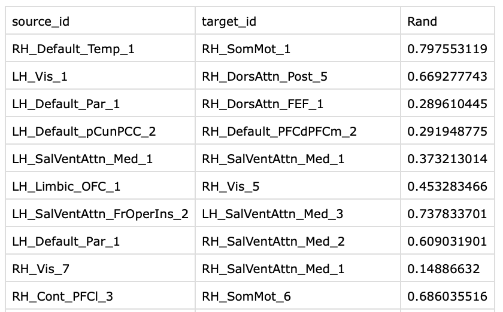
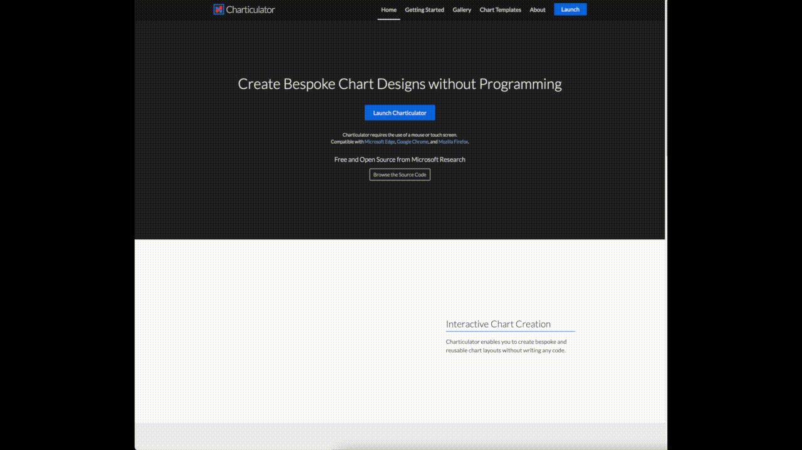
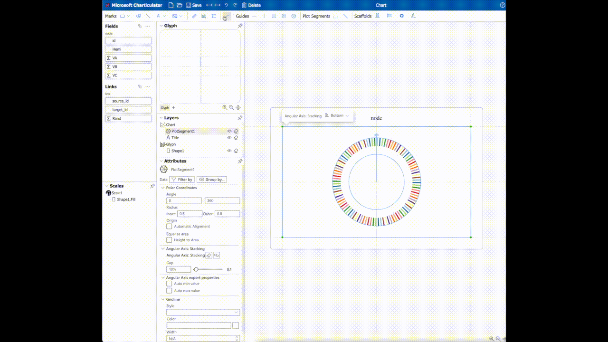
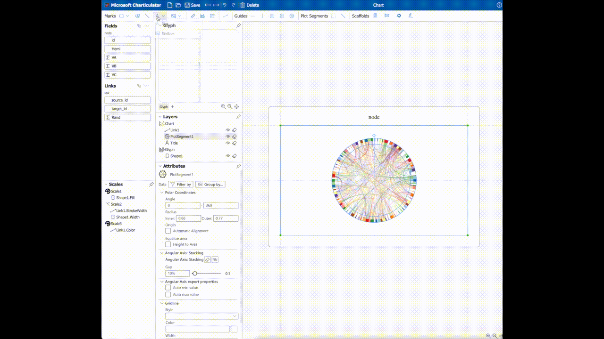

和弦图用于展示不同实体之间的关系，在脑网络研究中也经常使用。本文将介绍一个绘制和弦图的网站并演示其用法。

网址：https://charticulator.com

# 数据准备

首先准备两个表格，内容分为为和弦图中的节点信息和连边的信息，对应示例中的node.csv和link.csv。

node.csv中必须包含id列，用于唯一标识和弦图中的节点。示例中的节点为Schaefer等人在2018年发布的100个脑区的脑图谱。其他列为可选列，可以用来指定和弦图中节点的大小等。

<!-- -->

link.csv中必须包含source_id和target_id列，其值为node.csv中id的值。link.csv中每一行表示和弦图中一条连边。同样，其他列为可选列，可以指定和弦图中连边的宽度等。

<!-- -->

# 步骤

## 加载数据

打开网站后，将node.csv和link.csv分别拖动到Node和Links，然后点击Done即可完成数据的加载。之后网页会跳转到绘图页面。

<!-- -->

## 添加节点

第一步，点击顶栏的矩形块，并在绘图区插入选中的矩形块，会自动添加与node.csv文件中指定的节点个数相等的矩形块。
第二步，将id拖动到矩形块的color属性上，用不同的颜色来区分节点。
第三步，将矩形块按照x轴堆叠的方式排列，并设置为极坐标显示。
第四步，调整矩形块的内外环半径。

<!-- -->

## 添加连边

第一步，点击顶栏的边按钮，添加连边。
第二步，将target_id的颜色设置为连边的颜色。
第三步，将连边权重值设置为边的宽度。

<!-- -->

## 添加文本

第一步，点击顶栏文本按钮。
第二步，将id拖动到添加的文本元素上。
第三步，调整文本的方向和大小。

<!-- -->

## 导出图片

点击保存按钮，并调整dpi后，得到最终的图片。

<!-- -->

# 参考文献

脑图谱文章：Schaefer, Alexander, Ru Kong, Evan M. Gordon, Timothy O. Laumann, Xi-Nian Zuo, Avram J. Holmes, Simon B. Eickhoff, and B. T. Thomas Yeo. 2018. “Local-Global Parcellation of the Human Cerebral Cortex from Intrinsic Functional Connectivity MRI.” Cerebral Cortex 28(9):3095–3114. doi: 10.1093/cercor/bhx179.
