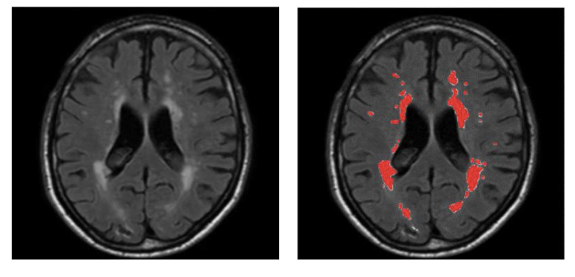
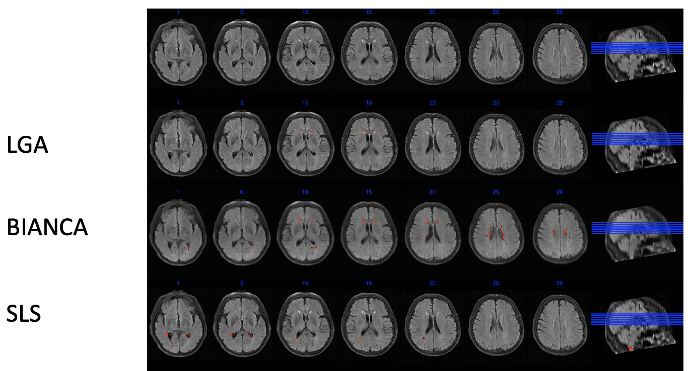

## 介绍

白质高信号（white matter hyperintensity, WMH）是一种因脑白质病变导致的、在T2 Flari像上表现为高灰质值的现象。在相关研究中，确定白质高信号区域是一个基本的问题。一般认为，由专业的影像科医生或受过培训的人员手动分割的结果是金标准。然而，手动分割费时费力。因而，研究者提出了许多自动半自动的分割工具。本文将对几种常用的白质高信号自动分割工具的用法进行简单介绍。

<!-- -->

## LST

LST (https://www.applied-statistics.de/lst.html) 是基于SPM的白质高信号分割工具，它包含两个分割算法：LPA和LGA。其中，LPA不需要T1数据，而LGA需要T1和Flari数据。

代码入下：

### LPA

尽管LPA在分割WMH的时候不需要T1数据，然而在输入里面还是可以将T1数据输入，用来作为配准的参考图像。

```matlab
% WMH segment by LPA in LST.
close all; clear; clc;

% Set SPM12 into Path.
SPM_PATH = '~/Tools/spm12';
addpath(SPM_PATH);

% Set root path.
ROOT = 'Work';

subs = dir(ROOT);
subs = subs(3:end);
for i = 1:numel(subs)
    % for single subject.
    disp(subs(i).name);
    sub_path = fullfile(ROOT, subs(i).name);
    
    t1_path = fullfile(sub_path, 't1.nii');
    if ~exist(t1_path, 'file')
        % gunzip the .gz file.
        gunzip(fullfile(sub_path, 't1.nii.gz'));
    end
    flair_path = fullfile(sub_path, 'flair.nii');
    if ~exist(flair_path, 'file')
        gunzip(fullfile(sub_path, 'flair.nii.gz'));
    end
    
    pause(10);
    
    spm_jobman('initcfg');
    matlabbatch{1}.spm.tools.LST.lpa.data_F2 = {strcat(flair_path, ',1')};
    matlabbatch{1}.spm.tools.LST.lpa.data_coreg = {strcat(t1_path, ',1')};
    matlabbatch{1}.spm.tools.LST.lpa.html_report = 1;
    spm('defaults', 'pet');
    spm_jobman('run', matlabbatch);
    clear matlabbatch;
end
```

### LGA

```matlab
% WMH segment by LGA in LST.
close all; clear; clc;

% Set SPM12 into Path.
SPM_PATH = '/home/babri3/Tools/spm12';
addpath(SPM_PATH)

% Set root path.
ROOT = 'Work';


subs = dir(ROOT);
subs = subs(3:end);
for i = 1:numel(subs)
    % for single subject.
    disp(subs(i).name);
    sub_path = fullfile(ROOT, subs(i).name);
    
    t1_path = fullfile(sub_path, 't1.nii');
    if ~exist(t1_path, 'file')
        % gunzip the .gz 
        gunzip(fullfile(sub_path, 't1.nii.gz'));
    end
    flair_path = fullfile(sub_path, 'flair.nii');
    if ~exist(flair_path, 'file')
        gunzip(fullfile(sub_path, 'flair.nii.gz'));
    end
    pause(10);
    disp(t1_path);
    disp(flair_path);
    spm_jobman('initcfg');
   %-----------------------------------------------------------------------
    % Job saved on 29-Sep-2020 18:30:58 by cfg_util (rev $Rev: 6942 $)
    % spm SPM - SPM12 (7219)
    % cfg_basicio BasicIO - Unknown
    %-----------------------------------------------------------------------
    matlabbatch{1}.spm.tools.LST.lga.data_T1 = {strcat(t1_path, ',1')};
    matlabbatch{1}.spm.tools.LST.lga.data_F2 = {strcat(flair_path, ',1')};
    matlabbatch{1}.spm.tools.LST.lga.opts_lga.initial = 0.3;
    matlabbatch{1}.spm.tools.LST.lga.opts_lga.mrf = 1;
    matlabbatch{1}.spm.tools.LST.lga.opts_lga.maxiter = 50;
    matlabbatch{1}.spm.tools.LST.lga.html_report = 1;
    spm('defaults','pet');
    spm_jobman('run', matlabbatch);
    clear matlabbatch;
end
```

## BIANCA

BIANCA (https://fsl.fmrib.ox.ac.uk/fsl/fslwiki/BIANCA) 是一种基于监督学习的WMH分割工具，是FSL的一个子模块。在使用它之前，需要先得到一部分被试的分割结果作为训练数据。可用其他的自动化分割方法的结果作为训练数据。

BIANCA需要一个master文件用于指定训练数据的路径。生成master文件的代码如下：

```python
src = 'Work-BIANAC'
res = ''

for i in os.listdir(src):
    sub_path = os.path.join(src, i)
    
    res += '{}\t{}\t{}\t{}\n'.format(
        os.path.join(sub_path, 't1_brain.nii.gz'),
        os.path.join(sub_path, 'flair_to_t1.nii.gz'),
        os.path.join(sub_path, 't1_brain_to_mni.mat'),
        os.path.join(sub_path, 'lesion_lpa.nii')
    )

with open('masterfile_lpa.txt', 'w') as f:
    f.writelines(res)
    logging.info('Finished.')
```

另外，BIANCA需要标准空间下的脑组织图像（对T1图像进行bet和配准操作），代码如下：

```python
import os
import shutil
from nipype.interfaces import fsl
import logging

src = 'Work-BIANAC'
for i in os.listdir(src):
  logging.info(f'{i}...')
  sub_path = os.path.join(src, i)
  
  if not os.path.exists(os.path.join(sub_path, 'lesion_lga.nii')):
    shutil.copy(os.path.join('Work-LST', i, 'ples_lga_0.3_rmflair.nii'),
                os.path.join(sub_path, 'lesion_lga.nii'))
    shutil.copy(os.path.join('Work-LST', i, 'ples_lpa_mrflair.nii'),
                os.path.join(sub_path, 'lesion_lpa.nii'))
    
  
  # flair to t1
  flt_flair_to_t1 = fsl.FLIRT(bins=256, cost_func='corratio')
  flt_flair_to_t1.inputs.in_file = os.path.join(sub_path, 'flair.nii.gz')
  flt_flair_to_t1.inputs.reference = os.path.join(sub_path, 't1.nii.gz')
  flt_flair_to_t1.inputs.output_type = 'NIFTI_GZ'
  flt_flair_to_t1.inputs.out_file = os.path.join(sub_path, 'flair_to_t1.nii.gz')
  flt_flair_to_t1.inputs.out_matrix_file = os.path.join(sub_path, 'flair_to_t1.mat')
  logging.info(flt_flair_to_t1.cmdline)
  res_flt_flair_to_t1 = flt_flair_to_t1.run()
  logging.info('Finish...')
  
  # betting t1
  btr_t1 = fsl.BET()
  btr_t1.inputs.in_file = os.path.join(sub_path, 't1.nii.gz')
  btr_t1.inputs.frac = 0.5
  btr_t1.inputs.out_file = os.path.join(sub_path, 't1_brain.nii.gz')
  btr_t1.inputs.output_type = 'NIFTI_GZ'
  btr_t1.inputs.mask = True
  btr_t1.inputs.robust = True
  logging.info(btr_t1.cmdline)
  res_btr_t1 = btr_t1.run()
  logging.info('Finish...')

  
  # t1 to mni
  flt_t1_to_mni = fsl.FLIRT(bins=256, cost_func='corratio')
  flt_t1_to_mni.inputs.in_file = os.path.join(sub_path, 't1_brain.nii.gz')
  flt_t1_to_mni.inputs.reference = '/usr/local/fsl/data/standard/MNI152_T1_2mm_brain.nii.gz'
  flt_t1_to_mni.inputs.output_type = 'NIFTI_GZ'
  flt_t1_to_mni.inputs.out_file = os.path.join(sub_path, 't1_brain_to_mni.nii.gz')
  flt_t1_to_mni.inputs.out_matrix_file = os.path.join(sub_path, 't1_brain_to_mni.mat')
  logging.info(flt_t1_to_mni.cmdline)
  res_flt_t1_to_mni = flt_t1_to_mni.run()
  logging.info('Finish...')
```

运行BIANCA，代码如下：

```python
import os
import logging

src = 'Work-BIANCA'
subs = os.listdir(src)
for i in range(len(subs)):
  sub_path = os.path.join(src, subs[i])
  cmdline = 'bianca '\
      + '--singlefile=masterfile_lga.txt '\
      + '--labelfeaturenum=4 '\
      + '--brainmaskfeaturenum=1 '\
      + '--querysubjectnum=#1 '\
      + '--trainingnums=1,2,3,4,5,6,7,8,9,10 '\
      + '--featuresubset=1,2 '\
      + '--matfeaturenum=3 '\
      + '--trainingpts=2000 '\
      + '--nonlespts=10000 '\
      + '--selectpts=noborder '\
      + '-o #2 -v'
  cmdline = cmdline.replace('#1', str(i+1))
  cmdline = cmdline.replace('#2', os.path.join(sub_path, 'bianca_output_lga'))
  logging.info(cmdline)
  os.system(cmdline)
  logging.info('Finished lga.')
  
  cmdline = 'bianca '\
      + '--singlefile=masterfile_lpa.txt '\
      + '--labelfeaturenum=4 '\
      + '--brainmaskfeaturenum=1 '\
      + '--querysubjectnum=#1 '\
      + '--trainingnums=1,2,3,4,5,6,7,8,9,10 '\
      + '--featuresubset=1,2 '\
      + '--matfeaturenum=3 '\
      + '--trainingpts=2000 '\
      + '--nonlespts=10000 '\
      + '--selectpts=noborder '\
      + '-o #2 -v'
  cmdline = cmdline.replace('#1', str(i+1))
  cmdline = cmdline.replace('#2', os.path.join(sub_path, 'bianca_output_lpa'))
  logging.info(cmdline)
  os.system(cmdline)
  logging.info('Finished lga.')
```

## SLS

SLS (http://atc.udg.edu/salem/slsToolbox/docs.html) 也是基于SPM的一种WMH分割工具包，需要将其安装文件夹放置于SPM的toolbox文件夹下。运行代码如下：

```matlab
% WMH segment by SLS.
clear all; clc; close all;

% Set SPM12 into Path.
SPM_PATH = '~/Tools/spm8';
addpath(SPM_PATH);
SLS_PATH = fullfile(SPM_PATH, 'toolbox', 'SLSToolBox');
addpath(genpath(SLS_PATH));

% Set root path.
ROOT = 'Work-SLS';

subs = dir(ROOT);
subs = subs(3:end);
for i = 1:numel(subs)
    % for single subject.
    disp(subs(i).name);
    sub_path = fullfile(ROOT, subs(i).name);
    
    t1_path = fullfile(sub_path, 't1.nii');
    flair_path = fullfile(sub_path, 'flair.nii');

    spm_jobman('initcfg');
    matlabbatch{1}.spm.tools.SLS.lesionSegment.data_T1 = {strcat(t1_path, ',1')};
    matlabbatch{1}.spm.tools.SLS.lesionSegment.data_FLAIR = {strcat(flair_path, ',1')};
    matlabbatch{1}.spm.tools.SLS.lesionSegment.params.stIter.alpha = 2.5;
    matlabbatch{1}.spm.tools.SLS.lesionSegment.params.stIter.omegaT = 0.6;
    matlabbatch{1}.spm.tools.SLS.lesionSegment.params.stIter.omegaN = 0.55;
    matlabbatch{1}.spm.tools.SLS.lesionSegment.params.stIter.lesionSize = 30;
    matlabbatch{1}.spm.tools.SLS.lesionSegment.params.ndIter.alpha2 = 2;
    matlabbatch{1}.spm.tools.SLS.lesionSegment.params.ndIter.omegaT2 = 0.75;
    matlabbatch{1}.spm.tools.SLS.lesionSegment.params.ndIter.omegaN2 = 0.7;
    matlabbatch{1}.spm.tools.SLS.lesionSegment.params.ndIter.lesionSize2 = 20;
    matlabbatch{1}.spm.tools.SLS.lesionSegment.exclusion.ventricles = 0;
    matlabbatch{1}.spm.tools.SLS.lesionSegment.outputs.lesionMaskst = 0;
    matlabbatch{1}.spm.tools.SLS.lesionSegment.outputs.lesionMasknd = 0;
    matlabbatch{1}.spm.tools.SLS.lesionSegment.outputs.thrst = 0;
    matlabbatch{1}.spm.tools.SLS.lesionSegment.outputs.thrnd = 0;
    matlabbatch{1}.spm.tools.SLS.lesionSegment.outputs.cleanup = 0;

    spm('defaults', 'pet');
    spm_jobman('run', matlabbatch);
    clear matlabbatch;
end
```

## W2MHS

W2MHS (https://www.nitrc.org/projects/w2mhs/) 是基于MATLAB的一种WMH分割工具，运行前需要将安装文件夹添加进MATLAB的搜索路径中。其运行脚本如下：

```matlab
% WMH segment by W2MHS.

clear all; clc; close all;
output_path = {'Work-W2MHS/Output'};
output_name = {'W2MHS'};
output_ids = {'sub-1', 'sub-1'; 'sub-2', 'sub-2'; 'sub-3', 'sub-3'; 'sub-4', 'sub-4'; 'sub-5', 'sub-5';...
    'sub-6', 'sub-6'; 'sub-7', 'sub-7'; 'sub-8', 'sub-8'; 'sub-9', 'sub-9'; 'sub-10', 'sub-10'};
input_images = {'Work-W2MHS/T1/sub-01_t1.nii', 'Work-W2MHS/FLAIR/sub-01_flair.nii';...
    'Work-W2MHS/T1/sub-02_t1.nii', 'Work-W2MHS/FLAIR/sub-02_flair.nii';...
    'Work-W2MHS/T1/sub-03_t1.nii', 'Work-W2MHS/FLAIR/sub-03_flair.nii';...
    'Work-W2MHS/T1/sub-04_t1.nii', 'Work-W2MHS/FLAIR/sub-04_flair.nii';...
    'Work-W2MHS/T1/sub-05_t1.nii', 'Work-W2MHS/FLAIR/sub-05_flair.nii';...
    'Work-W2MHS/T1/sub-06_t1.nii', 'Work-W2MHS/FLAIR/sub-06_flair.nii';...
    'Work-W2MHS/T1/sub-07_t1.nii', 'Work-W2MHS/FLAIR/sub-07_flair.nii';...
    'Work-W2MHS/T1/sub-08_t1.nii', 'Work-W2MHS/FLAIR/sub-08_flair.nii';...
    'Work-W2MHS/T1/sub-09_t1.nii', 'Work-W2MHS/FLAIR/sub-09_flair.nii';...
    'Work-W2MHS/T1/sub-10_t1.nii', 'Work-W2MHS/FLAIR/sub-10_flair.nii'};
input_meth = {'rf_regress'};
w2mhstoolbox_path = './Work-W2MHS/W2MHS';
spmtoolbox_path = '/home/babri3/Tools/spm12';
do_train = 'no';
do_preproc = 'no'; 
do_quantify = 'yes';
param(.6, 2.5, 'yes');
WhyD_setup(output_name, output_path, input_images, output_ids, w2mhstoolbox_path,...
    spmtoolbox_path, do_train, do_preproc, do_quantify);
```

## UBO

另外，还有一种基于MATLAB和SPM的分割工具包UBO，它的使用手册：https://cheba.unsw.edu.au/sites/cheba2/files/_local_upload/pdf/groups/neuroimaging-group-pipeline-quick-start-manual.pdf.

<!-- -->

## 部分分割结果

<!-- -->

## 相关链接

LST: https://www.applied-statistics.de/lst.html

BIANCA: https://fsl.fmrib.ox.ac.uk/fsl/fslwiki/BIANCA

SLS: http://atc.udg.edu/salem/slsToolbox/docs.html

W2MHS: https://www.nitrc.org/projects/w2mhs/

UBO: https://cheba.unsw.edu.au/research-groups/neuroimaging/pipeline
