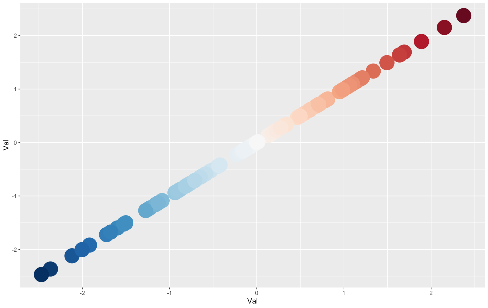
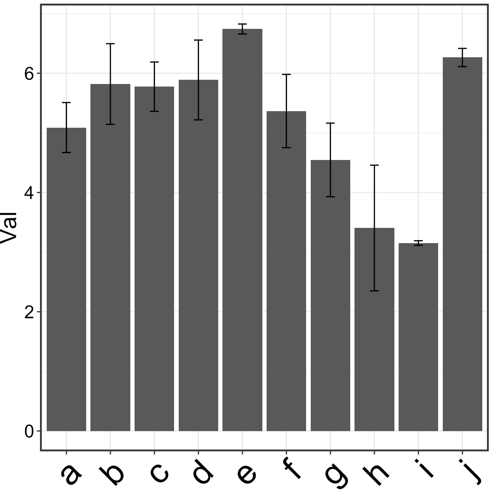

## 自定义Colormap

在一些场景下，我们需要自己构造数字与颜色的对应关系。比如，我们在探究每个ROI随龄变化的趋势时，我们需要将回归方程中年龄的系数展示在脑图上。朴素的想法是，我构造一个关于系数与颜色的映射关系，给定某一系数，就返回相应的颜色。实现方法如下：

```R
library(tidyverse)
library(RColorBrewer)

data <- data.frame(Val = rnorm(100)) %>% as_tibble()

# 选择合适的颜色
colors <- brewer.pal(11, 'RdBu')
# 考虑到数字的正负号，我们这里用差异较明显的颜色区分正负
pos.color <- colorRampPalette(colors[6:1])(1000 * round(max(data$Val), 3) + 1)
neg.color <- colorRampPalette(colors[6:11])(-1000 * round(min(data$Val), 3) + 1)

res <- rep('', length(data$Val))
for (i in 1:length(data$Val)) {
  if (round(data$Val[i], 3) < 0) {
    res[i] <- neg.color[1000 * round(-data$Val[i], 3)]
  } else if (round(data$Val[i], 3) > 0) {
    res[i] <- pos.color[1000 * round(data$Val[i], 3)]
  } else {
    res[i] <- pos.color[1]
  }
}
data['Color'] <- res
data[, c('Red', 'Green', 'Blue')] <- t(col2rgb(res)) / 255

# 演示颜色
ggplot(data = data, aes(x = Val, y = Val)) +
  geom_point(color = data$Color, size = 10)
```

其中，data中同一行表示数字与对应的颜色。

效果如下所示：

<!-- -->

## 带误差线的柱状图

```R
library(tidyverse)

data <- data.frame(
  val = rnorm(10) + 5,
  error = rnorm(10),
  name = letters[1:10]
)
data %>%
  ggplot(aes(x = name, y = val)) +
  geom_bar(stat = 'identity') +
  # 添加误差线
  geom_errorbar(aes(ymin = val - error, ymax = val + error, width = 0.2)) +
  labs(y = 'Val', x = '') +
  theme_bw() + 
  theme(legend.position = 'None',
        axis.title = element_text(size = 20),
        axis.text = element_text(size = 16, colour = 'black'),
        panel.border = element_rect(size = 1.5),
        # 将x轴标签旋转一定角度
        axis.text.x = element_text(size = 30, angle = 45, vjust = 1, hjust = 1))
```

效果如下所示：

<!-- -->
