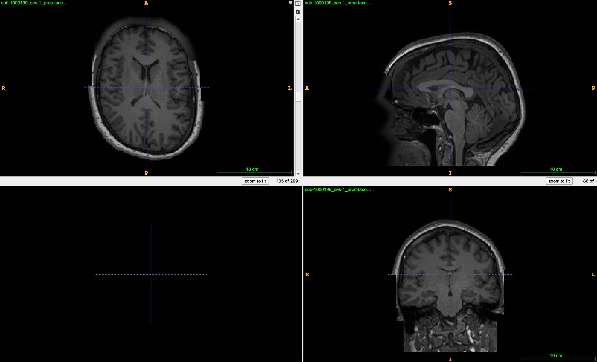
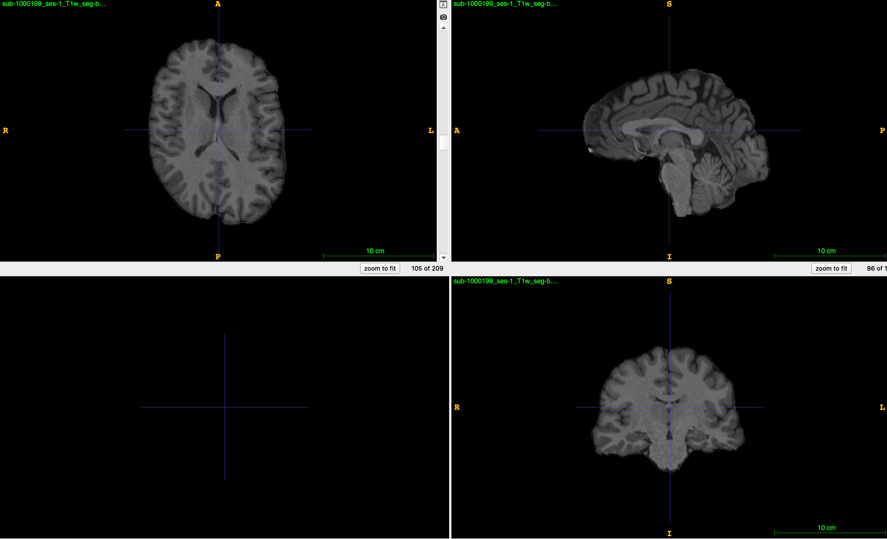

# DICOM文件

DICOM格式是医学成像设备输出的统一的文件格式，它包含数据头信息和数据信息两部分。其中头信息包含扫描设备的信息以及被试的信息等，另外还包括其他关于数据的元信息。数据部分是扫描设备采集到扫描物体的信号值。

利用Pydicom包可以使用Python操作DICOM文件，包括对DICOM文件的读写、头信息的增删改等。

## 安装

``` {.bash}
pip install pydicom
# 或
conda install -c conda-forge pydicom
```

## 示例数据

``` {.python}
from pydicom.data import get_testdata_file
fpath = get_testdata_file("CT_small.dcm")
fpath
```

Out: '/Applications/miniconda3/lib/python3.9/site-packages/pydicom/data/test_files/CT_small.dcm'

## 读入文件

```python
from pydicom import dcmread
ds = dcmread(fpath)
ds
```

输出：

```
Dataset.file_meta -------------------------------
(0002, 0000) File Meta Information Group Length  UL: 192
(0002, 0001) File Meta Information Version       OB: b'\x00\x01'
(0002, 0002) Media Storage SOP Class UID         UI: CT Image Storage
(0002, 0003) Media Storage SOP Instance UID      UI: 1.3.6.1.4.1.5962.1.1.1.1.1.20040119072730.12322
(0002, 0010) Transfer Syntax UID                 UI: Explicit VR Little Endian
(0002, 0012) Implementation Class UID            UI: 1.3.6.1.4.1.5962.2
(0002, 0013) Implementation Version Name         SH: 'DCTOOL100'
(0002, 0016) Source Application Entity Title     AE: 'CLUNIE1'
...
```

## 访问数据的子元素

可以通过两种方式访问ds中的元素，其一是利用元素的位置，即每个元素中最前面的两个两位十六进制数，如(0x0043, 0x104e)；其二是利用元素的名称访问。下面对三种方式分别进行演示。

### 按位置访问

```python
elem = ds[0x0008, 0x0008]
elem
```
Out: (0008, 0008) Image Type                          CS: ['ORIGINAL', 'PRIMARY', 'AXIAL']

### 按名称访问

```python
elem = ds['ImageType']
elem
```
Out: (0008, 0008) Image Type                          CS: ['ORIGINAL', 'PRIMARY', 'AXIAL']

### 访问元素的值

```python
val = ds.ImageType
val

val = ds['ImageType'].value
val
```

Out: ['ORIGINAL', 'PRIMARY', 'AXIAL']

### 嵌套元素

头信息中包含部分嵌套的元素，这些元素的子元素不能通过位置和名称直接访问，得先获取到嵌套元素后，再按照类似数组的方式访问它里面的元素。

```python
nelem = ds['OtherPatientIDsSequence']
nelem
```
Out: <Sequence, length 2>


```python
nelem[0]
````

Out: (0010, 0020) Patient ID                          LO: 'ABCD1234'

(0010, 0022) Type of Patient ID                  CS: 'TEXT'


## 修改元素

```python
nelem[0]['PatientID'].value = 'TestDemo'
# 或
nelem[0].PatientID = 'TestDemo'
```

## 删除元素

```python
del ds[0x0028, 0x1050]
# 或
del ds['PatientID']
```

## 增加元素

```python
ds.add_new([0x0028, 0x1050], 'DS', "100.0")
# 或
ds.WindowWidth = 500
```

## 保存文件

```python
ds.save_as('Test.dcm')
```

# NIFTI文件

## 安装

```bash
pip install nibabel
```

## 数据获取

以下代码会自动下载示例数据到nibabel的目录下。

```python
import os
import numpy as np
from nibabel.testing import data_path
example_file = os.path.join(data_path, 'example4d.nii.gz')
example_file
```
Out: '/Applications/miniconda3/lib/python3.9/site-packages/nibabel/tests/data/example4d.nii.gz'

## 数据读取

```python
import nibabel as nib

img = nib.load(example_file)
img
```
Out: <nibabel.nifti1.Nifti1Image at 0x7fd908af12b0>

这里的img就是Nifti文件本身，通过它可以访问到文件的头信息和数据矩阵。

## 数据头信息

```python
header = img.header
header
print(header)
```
Out: <nibabel.nifti1.Nifti1Header at 0x7fd908af1460>
```
<class 'nibabel.nifti1.Nifti1Header'> object, endian='<'
sizeof_hdr      : 348
data_type       : b''
db_name         : b''
extents         : 0
session_error   : 0
regular         : b'r'
dim_info        : 57
dim             : [  4 128  96  24   2   1   1   1]
intent_p1       : 0.0
intent_p2       : 0.0
intent_p3       : 0.0
intent_code     : none
datatype        : int16
bitpix          : 16
slice_start     : 0
pixdim          : [-1.000000e+00  2.000000e+00  2.000000e+00  2.199999e+00  2.000000e+03
  1.000000e+00  1.000000e+00  1.000000e+00]
vox_offset      : 0.0
...
```

## 数据矩阵

```python
data = img.get_fdata()
data.shape
```
Out: (128, 96, 24, 2)

数据矩阵可以执行矩阵的运算等操作，可通过numpy包进行执行相关操作。

img对象的slicer方法可以选择特定层的数据，并返回一个img对象。

```python
img_slice = img.slicer[32:-32, ...]
img_slice.shape
```
Out: (64, 96, 24, 2)

img包含一个标识矩阵方向与实际空间中方向的矩阵，较affine矩阵，可通过img.affine访问。

通过函数nib.orientations.aff2axcodes(img.affine)可返回affine对应的实际空间中的方向。具体的信息请参考：https://sangfengchn.github.io/home/post/2021/06/02/blog/

上面函数的返回信息为：('L', 'A', 'S')，表示矩阵x轴的正方向为被试的左边，矩阵y轴的正方向为被试的前面，z轴正方向表示被试的下面。详细描述：https://nipy.org/nibabel/coordinate_systems.html#nibabel-always-uses-an-ras-output-space

## 保存

```python
img_slice.to_filename('TestNifti.nii.gz')
# 或
img_save = nib.Nifti1Image(data, img.affine)
nib.save(img_save, 'TestNifti2.nii.gz')
```

# 可视化

nilearn提供了较为完备的可视化功能，同时也提供了统计功能。这里只介绍它的可视化功能。

## 加载数据

```python
from nilearn import datasets

# one motor contrast map from NeuroVault
motor_images = datasets.fetch_neurovault_motor_task()
stat_img = motor_images.images[0]
stat_img
```
Out: '/Users/xxxx/nilearn_data/neurovault/collection_658/image_10426.nii.gz'

## 演示一：激活图

```python
from nilearn import plotting

plotting.plot_stat_map(stat_img, threshold=3, title="plot_stat_map", cut_coords=[36, -27, 66])
```

<!-- -->

## 演示二：交互激活图

```python
plotting.view_img(stat_img, threshold=3)
```

<!-- -->

## 演示三：玻璃脑

```python
plotting.plot_glass_brain(stat_img, title='plot_glass_brain', threshold=3)
```

<!-- -->


## 演示四：结构像

```python
plotting.plot_anat('sub-1000199_ses-1_proc-facemask_T1w.nii.gz', title="plot_anat")
```

<!-- -->

# 数据分析

nipype提供了常用神经影像分析工具包的接口，包括FSL、FreeSurfer、ANTs等。

这里以ANTs去除非脑组织为例。ANTs去非脑组织的过程是通过配准来实现的，需要事先提供[带颅骨的模版](file://./file/T_template0.nii.gz)和只包含[脑组织的模版](file://./file/T_template0_BrainCerebellumMask.nii.gz)。

```python
import os
from nipype.interfaces.ants.segmentation import BrainExtraction

anatomical_image = 'sub-1000199_ses-1_proc-facemask_T1w.nii.gz'
template = 'MICCAI2012-Multi-Atlas-Challenge-Data/T_template0.nii.gz'
brainmask = 'MICCAI2012-Multi-Atlas-Challenge-Data/T_template0_BrainCerebellumMask.nii.gz'
out_prefix = 'sub-1000199_ses-1_T1w_seg-brain'

brain_extraction = BrainExtraction(
    dimension=3,
    anatomical_image=anatomical_image,
    brain_template=template,
    brain_probability_mask=brainmask,
    out_prefix = out_prefix,
    num_threads=32)

brain_extraction.run()
```

原始图像：

<!-- -->

结果图像：

<!-- -->

另外，nipype还提供了处理流程图（workflow engine），可以方便地将不同处理工具整合进一个处理流程里面。官方文档提供了DTI、fMRI和sMRI部分处理的例子。

# 参考

1. pydicom: https://pydicom.github.io

2. nibabel: https://nipy.org/nibabel/

3. nilearn: https://nilearn.github.io/stable/index.html

4. nipype: https://nilearn.github.io/stable/index.html
