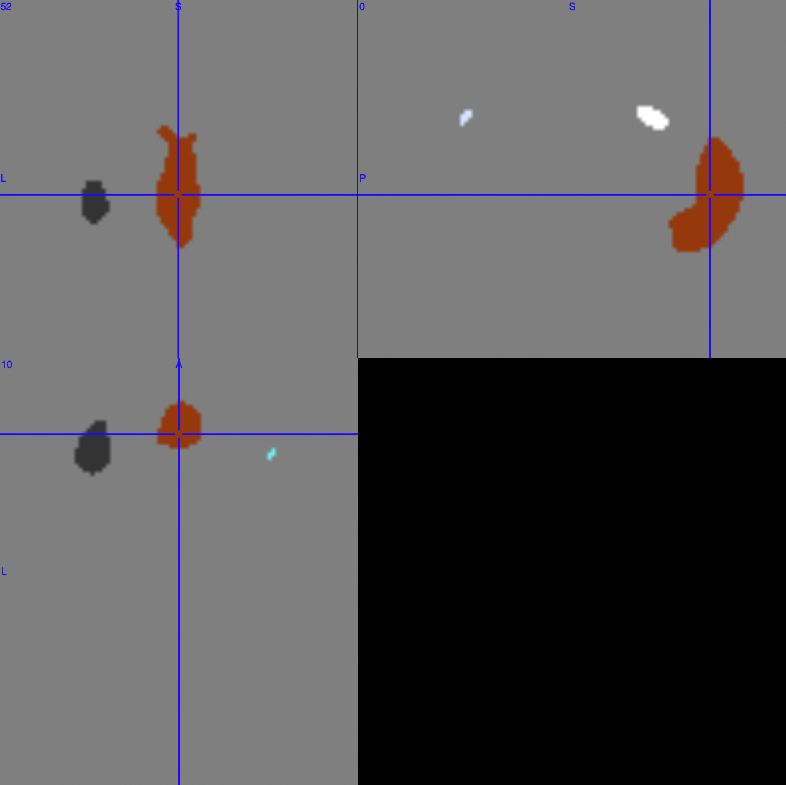

# 问题

我们在对神经影像数据做完统计后（例如ICA），会得到相应的mask二值文件。但是有些情况下，我们还需要进一步对mask中每一个cluster进行分析（例如计算mask中每个cluster之间的功能连接）。所以我们需要从mask文件中得到每一个cluster。由于没有想到有哪个现成的工具包可以解决上述的问题。因此，本文试图用自己的方式去解决上述的问题。

# 方法

## 思路一

看到这个问题的时候，最朴素的想法就是用MRIcron/GL或者ITK-SNAP手动将mask中的每一个cluster标记出来。

## 思路二

虽然上述手动标记的方法能解决这个问题，但是显得没那么优雅（bushi。就想换用代码解决这个问题。而且写完代码下次再碰到类似的问题，就能直接使用了（还能水一篇推送。

首先我想着先找出mask中所有非零元素的下标，然后选一个非零元素，再去判断这个元素的邻域是否是0（如果是0就意味着已经到了这个cluster的边缘）。但是在三维图像里面，要判断邻域是否到达边缘，需要写8个条件判断，这也很不优雅（主要还是找到了一个现成的轮子。

之后在找“轮子”的时候，看到了scipy包里面的一个函数可以实现上面的过程。因此通过调用它近乎完美地解决了最开始的问题（bushi。下面是相应的代码。

```python
import nibabel as nib
from scipy.ndimage import measurements
import logging
logging.basicConfig(level=logging.INFO)

img = nib.load('test-binary.nii')
data = img.get_fdata()
labels, num_labels = measurements.label(data)
logging.info(f'The number of cluster is {num_labels}')
nib.save(nib.Nifti1Image(labels, img.affine), f'test_cluster-mix.nii')
for i in range(num_labels):
    tmp_data = np.zeros(data.shape)
    tmp_data[labels == i + 1] = 1
    nib.save(nib.Nifti1Image(tmp_data, img.affine), f'test_cluster-{i+1}.nii')
```

test-binary.nii是从Neurosynth上随便找的一个功能连接图谱，并以±0.2作为阈值得到的mask文件（Figure 1）。

<div class="figure">

<p class="caption"><span id="fig:unnamed-chunk-1"></span>Figure 1: test-binary.nii可视化结果。</p>
</div>


上述代码运行后，对于mask中的每一个cluster会得到一个.nii文件，同时也会得到一个混合了所有cluster的.nii文件。结果如Figure 2所示。

<div class="figure">

<p class="caption"><span id="fig:unnamed-chunk-2"></span>Figure 2: 混合了所有cluster的结果，其中每个cluster用一个整数标记。</p>
</div>

# 参考

1. https://neurosynth.org/locations/-4_24_46_6

2. https://stackoverflow.com/questions/52087533/how-to-find-number-of-clusters-in-a-image/52088840
