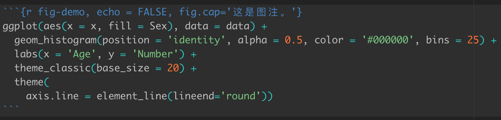

# R Markdown图表交叉引用

在R Markdown中给图表添加引用是首先需要在文件的输出格式设置为以下三种之一。

```r
output:
  # bookdown::word_document2: default
  bookdown::html_document2: default
  # bookdown::pdf_document2: default
```

其次在绘制图表时需要添加标签，如下图\@ref(fig:fig-demo)所示：

```{r fig-demo, echo = FALSE, fig.cap='这是一个示例。'}

```

其中fig-demo为图片的标签。在文中引用时，输入**\\@ref(fig:fig-demo)**即可自动添加图片引用。

# ggplot2添加标签

## 修改坐标轴端点样式

坐标轴端点样式可以通过如下命令修改，下图\@ref(fig:fig-round)、图\@ref(fig:fig-butt)和图\@ref(fig:fig-square)分别是三种端点样式的是示例图。

```r
theme(axis.line = element_line(lineend='round'))
```

```{r fig-round, echo = FALSE, fig.cap='这是round。'}
knitr::include_graphics('./img/demo-round.png')
```

```{r fig-butt, echo = FALSE, fig.cap='这是butt。'}
knitr::include_graphics('./img/demo-butt.png')
```

```{r fig-square, echo = FALSE, fig.cap='这是square。'}
knitr::include_graphics('./img/demo-square.png')
```

## 给柱状图添加标签

给柱状图每个柱子添加相应的数字标签可以通过geom_text函数完成，显示效果如图\@ref(fig:fig-label)所示。

```r
tmpData %>%
  count(MRIAGE_group, Sex) %>%
  ggplot(aes(x = MRIAGE_group, y = n, fill = Sex, label = n)) +
  geom_bar(stat = 'identity', position = position_dodge()) +
  geom_text(position = position_dodge(width = 0.9), vjust = -0.1) +
  labs(x = 'Age', y = 'Number') +
  theme_classic(base_size = 20) +
  theme(
    axis.line = element_line(lineend='round'),
    axis.text.x = element_text(angle = 45, hjust = 0.5, vjust = 0.6))
```

```{r fig-label, echo = FALSE, fig.cap='柱状图标签。'}
knitr::include_graphics('./img/demo-label.png')
```


